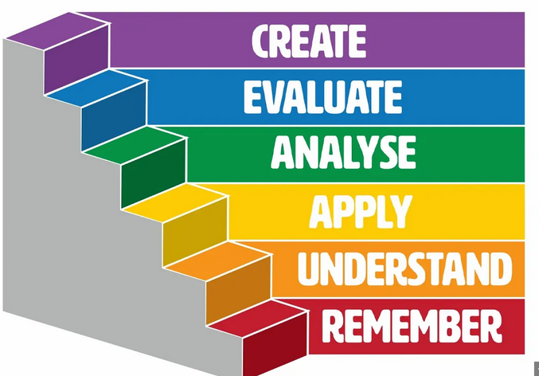

# Welcome to the Signal Theory Lab

This is a digital playground for exploring signal processing concepts. 

### Core Topics
- [Aliasing](lessons/aliasing.qmd)
- Frequency Analysis (Coming soon)
- Filter Design (Coming soon)

### Environment
The environment is built using:
- **NumPy** for numerical computation.
- **SciPy** for signal processing algorithms.
- **Matplotlib** for visualization.
- **Quarto** for document generation.

