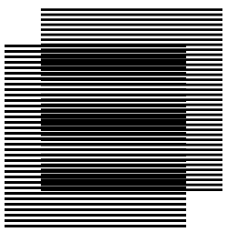

## Introduction to Aliasing
This lesson shows a continous "analog" signal being converted to a digital signal by an ADC (Analog-to-Digital Converter).
What we can observe from the results is the fact that a poorly sampled signal can become indistinguishable from a lower-frequency one.

## Setup and Parameters
First, we import our tools and define the physical properties of our signal and ADC.

```{python}
#| label: setup
import numpy as np
import matplotlib.pyplot as plt

f_real = 6000.0   # It's too fast (Greater than f_sample/2)
f_sample = 8000.0 # Our ADC is still at 8000 Hz
f_alias = 2000.0  # The "Ghost" signal the computer will see (|6000 - 8000|)
```

## Signal Simulation
We simulate the "continuous" analog world using a high-resolution array, and the digital world by sampling at discrete intervals.

```{python}
#| label: simulation
# 1. Simulate the "continuous" analog world
t_analog = np.linspace(0, 0.002, 1000) 
y_analog_real = np.sin(2 * np.pi * f_real * t_analog)

# 2. Simulate the digital world (discrete sampled points)
t_digital = np.arange(0, 0.002, 1.0 / f_sample)
y_digital = np.sin(2 * np.pi * f_real * t_digital)

# 3. Simulate the "alias" wave
y_analog_alias = -np.sin(2 * np.pi * f_alias * t_analog)
```

## Visualization
Finally, we plot the results to see how the samples align with the signals.

Visually the concept becomes very clear: the system will have no way of knowing if the blue samples reconstruct the gray signal or the red signal. 


```{python}
#| label: fig-aliasing
#| fig-cap: "Time-Domain Proof of Aliasing"

plt.figure(figsize=(10, 5))

# Plot the real fast wave
plt.plot(t_analog, y_analog_real, color='gray', alpha=0.5, label=f"Real Analog Signal ({f_real} Hz)")

# Plot the alias slow wave
plt.plot(t_analog, y_analog_alias, color='red', linestyle='--', label=f"Aliased Signal ({f_alias} Hz)")

# Plot the discrete samples
plt.stem(t_digital, y_digital, basefmt=" ", linefmt="blue", markerfmt="bo", label=f"Digital Samples ({f_sample} Hz)")

plt.title("Time-Domain Proof of Aliasing")
plt.xlabel("Time (s)")
plt.ylabel("Amplitude")
plt.legend()
plt.grid(True)
plt.show()
```

## The Nyquist Theorem
What we have demonstrated is the **Nyquist-Shannon Sampling Theorem**. It states that to capture a signal without losing information, we must sample at a rate ($f_s$) that is at least twice the highest frequency component of the signal ($f_{max}$).

$$f_s > 2 \cdot f_{max}$$

When we sampled a $6000\text{ Hz}$ signal at only $8000\text{ Hz}$, we violated this rule because $8000$ is not greater than $2 \times 6000$. 

## Extras: Moiré Pattern

Aliasing is not just about signals: it's about cameras, audio, and video games. It can be represented visually using the Moiré pattern.

For me, looking at this animation made the concept really click:

{#fig-moire fig-align="center" fig-alt="An animation showing the Moiré pattern"}
